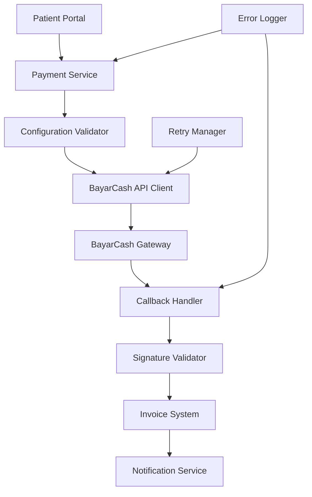

# BayarCash Payment Integration Fix - Design Document

## Overview

This design addresses the complete resolution of BayarCash payment gateway integration issues. The current implementation has the basic structure but lacks proper error handling, configuration validation, and robust payment flow management. This design will ensure reliable payment processing with comprehensive error handling and monitoring.

## Architecture

### Current Issues Identified

1. **Configuration Validation**: Missing proper validation of BayarCash credentials
2. **Error Handling**: Insufficient error handling in payment creation and callback processing
3. **Signature Generation**: Potential issues with signature algorithm implementation
4. **API Endpoint Compatibility**: Need to verify BayarCash API v3 compatibility
5. **Callback Security**: Enhanced security validation for webhook callbacks
6. **Payment Status Synchronization**: Better handling of payment status updates

### Proposed Solution Architecture



## Components and Interfaces

### 1. Enhanced BayarCash Service

**Purpose**: Improved payment service with robust error handling and validation

**Key Improvements**:
- Configuration validation on initialization
- Enhanced signature generation with debugging
- Proper error handling with detailed logging
- API compatibility verification
- Retry logic for network failures

**Interface**:
```typescript
interface EnhancedBayarCashService {
  validateConfiguration(): Promise<boolean>
  createPayment(request: PaymentRequest): Promise<PaymentResponse>
  verifyCallback(data: any): Promise<boolean>
  checkPaymentStatus(transactionId: string): Promise<PaymentStatusResponse>
  generateSignature(data: any): string
  testConnection(): Promise<boolean>
}
```

### 2. Configuration Validator

**Purpose**: Validate BayarCash credentials and configuration

**Features**:
- Check all required environment variables
- Validate credential format
- Test API connectivity
- Verify webhook URL accessibility

### 3. Enhanced Callback Handler

**Purpose**: Secure and reliable webhook processing

**Features**:
- Signature verification with detailed logging
- Idempotent payment processing
- Error recovery mechanisms
- Security audit logging

### 4. Payment Status Manager

**Purpose**: Manage payment status synchronization

**Features**:
- Real-time status checking
- Status reconciliation
- Timeout handling
- Status history tracking

## Data Models

### Enhanced Payment Request
```typescript
interface PaymentRequest {
  orderId: string
  amount: number
  currency: string
  description: string
  customerName: string
  customerEmail: string
  customerPhone?: string
  metadata?: Record<string, any>
}
```

### Enhanced Payment Response
```typescript
interface PaymentResponse {
  success: boolean
  paymentUrl?: string
  transactionId?: string
  error?: PaymentError
  debugInfo?: any
}

interface PaymentError {
  code: string
  message: string
  details?: any
  retryable: boolean
}
```

### Callback Data Model
```typescript
interface CallbackData {
  order_id: string
  transaction_id: string
  status: string
  amount: number
  currency: string
  signature: string
  timestamp: number
  [key: string]: any
}
```

## Error Handling

### Error Categories

1. **Configuration Errors**
   - Missing credentials
   - Invalid credential format
   - API connectivity issues

2. **Payment Creation Errors**
   - Invalid payment data
   - BayarCash API errors
   - Network failures

3. **Callback Processing Errors**
   - Invalid signatures
   - Duplicate callbacks
   - Database update failures

4. **Status Synchronization Errors**
   - Status check failures
   - Timeout handling
   - Reconciliation issues

### Error Recovery Strategies

1. **Retry Logic**: Exponential backoff for transient failures
2. **Fallback Mechanisms**: Alternative payment status checking
3. **Manual Intervention**: Admin tools for payment reconciliation
4. **User Communication**: Clear error messages and next steps

## Testing Strategy

### Unit Tests
- BayarCash service methods
- Signature generation and verification
- Configuration validation
- Error handling scenarios

### Integration Tests
- End-to-end payment flow
- Callback processing
- API connectivity
- Database operations

### Manual Testing
- Payment flow with test credentials
- Error scenarios simulation
- Callback webhook testing
- Status synchronization verification

## Security Considerations

### Signature Verification
- Enhanced signature algorithm implementation
- Detailed logging for debugging
- Timing attack prevention
- Signature replay protection

### Credential Management
- Secure environment variable handling
- Credential rotation support
- Access logging
- Encryption at rest

### Webhook Security
- IP whitelist validation
- Request rate limiting
- Payload size limits
- HTTPS enforcement

## Implementation Phases

### Phase 1: Core Fixes
- Fix configuration validation
- Enhance error handling
- Improve signature generation
- Add comprehensive logging

### Phase 2: Robustness
- Implement retry logic
- Add status synchronization
- Enhance callback security
- Add monitoring and alerts

### Phase 3: Testing & Validation
- Comprehensive test suite
- End-to-end testing
- Performance optimization
- Documentation updates

## Monitoring and Observability

### Metrics to Track
- Payment success/failure rates
- API response times
- Callback processing times
- Error frequencies by type

### Logging Strategy
- Structured logging with correlation IDs
- Sensitive data masking
- Debug mode for troubleshooting
- Audit trail for security events

### Alerting
- Payment failure rate thresholds
- API connectivity issues
- Callback processing failures
- Configuration problems

## Configuration Management

### Environment Variables
```env
# BayarCash Configuration
BAYARCASH_API_URL=https://api.console.bayar.cash/v3
BAYARCASH_PAT=your_personal_access_token
BAYARCASH_API_SECRET=your_api_secret
BAYARCASH_PORTAL_KEY=your_portal_key
BAYARCASH_RETURN_URL=https://yourdomain.com/patient/payment/return
BAYARCASH_CALLBACK_URL=https://yourdomain.com/api/payment/callback

# Debug and Monitoring
BAYARCASH_DEBUG=false
BAYARCASH_TIMEOUT=30000
BAYARCASH_RETRY_ATTEMPTS=3
```

### Validation Rules
- All required variables must be present
- URLs must be valid and accessible
- Credentials must match expected format
- Timeout values must be reasonable

This design ensures a robust, secure, and maintainable BayarCash payment integration that can handle various error scenarios and provide reliable payment processing for the healthcare platform.